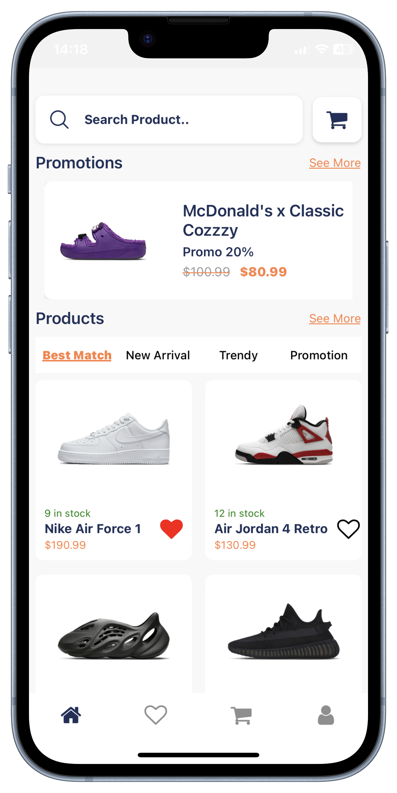
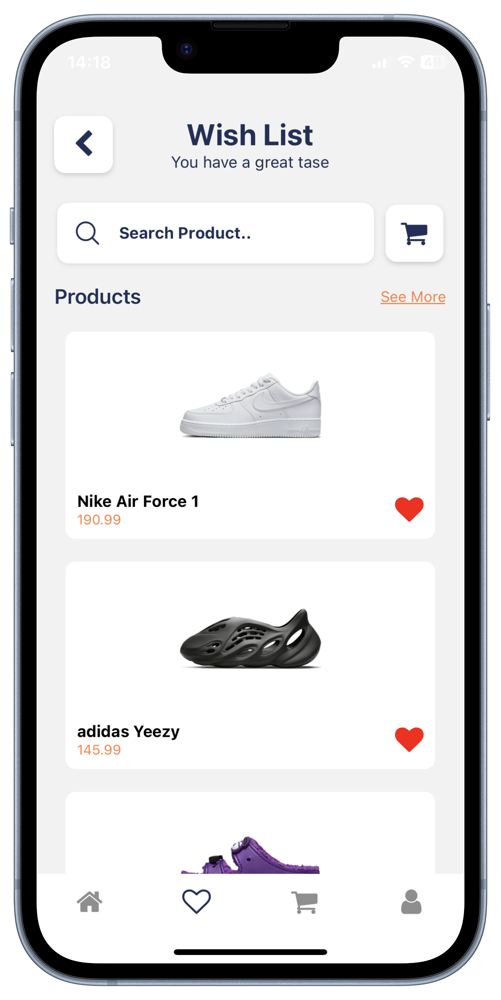
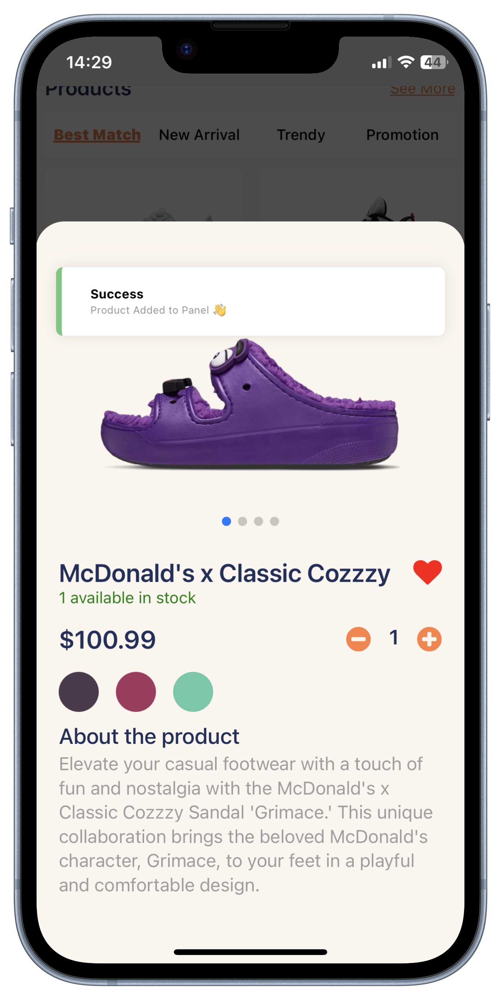
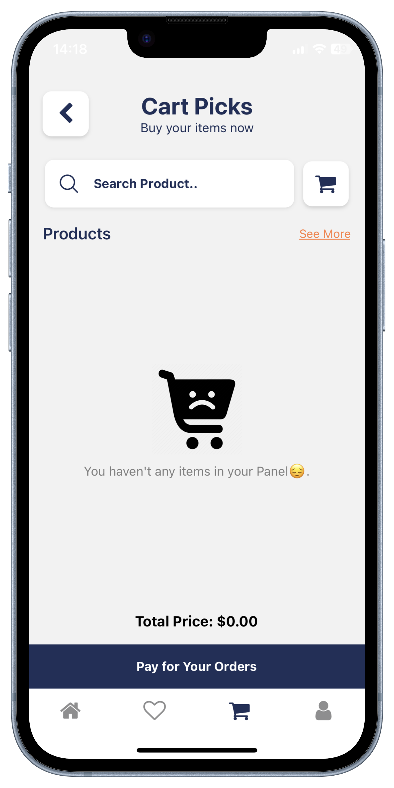
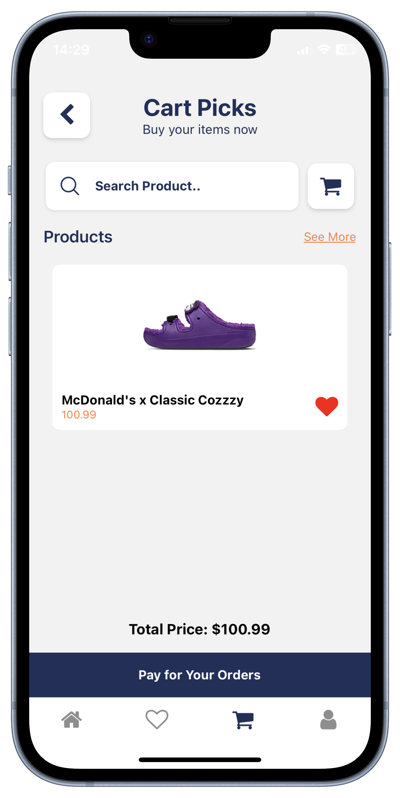
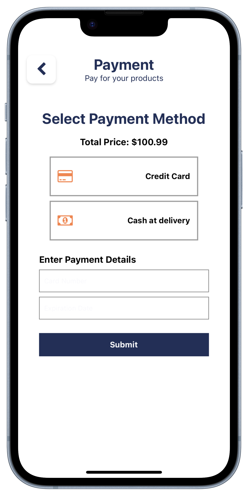
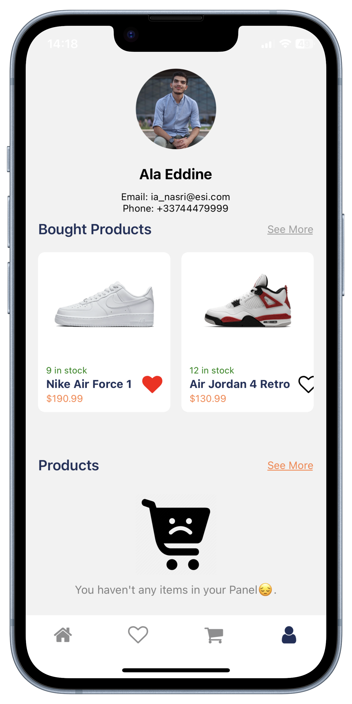

# ShoesStore

### Project Description

ShoesStore is a mobile application developed as part of a technical skills assessment at [Company Name]. This project serves as a demonstration of skills in React Native, Node.js, and related technologies. It simulates an online shoe store with features like product browsing, promotions, and user interactions.

## Mockups

<div style="display: flex; justify-content: space-between; align-items: center;">

|  |  |

</div>

### Video Demonstration

A video demonstration of the ShoesStore application is available at [https://drive.google.com/drive/folders/1pGGePzmOqajJenb_0d3W07W36HCoSC2I?usp=drive_link].

### Code Documentation

it will be avilable in few ours.
Explore the code documentation to understand the project structure, components, and functionalities. The documentation can be found [here](Link to your documentation).

Feel free to reach out if you have any questions or need further clarification.

## Table of Contents

- [Installation](#installation)
- [Usage](#usage)
- [Configuration](#configuration)
- [License](#license)
- [Contact Information](#contact-information)

## Installation

### Prerequisites:

#### 1. Node.js: https://nodejs.org/

#### 2. Expo CLI:

```bash
npm install -g expo-cli
```

#### 3. Expo Go App (If you running in real device): Install Expo Go on iOS/Android.

### Setting Up the React Native App:

```bash
#Clone the repo
git clone https://github.com/Alaeddine-Nasri/ShoesStore
# Navigate to the app repo
cd ShoesStore
# Install dependencies
npm install
# Start the application
expo start
```

### Run on Emulator or Device:

#### - For emulator, press 'e' in the terminal.

#### - For Expo Go app, scan the QR code with your device's camera.

### Setting Up the Node.js Server (Assuming Express is used):

```bash
# Navigate to the API directory
cd API
# Install dependencies
npm install
# Start the Node.js server
node server.js
```

### Additional Notes:

#### Update API URLs in the app to make sure it connects to the Node.js server.

#### Hosting on my local with ngrok:

#### Add a remote to your local repository and push your code.

## Usage

### 1. Getting Started

ShoesStore is a React Native application for browsing and purchasing shoes. Before you begin, ensure you have Node.js and npm installed.

### 2. User Interface

- Home Screen: View a curated selection of shoes, including promotional items.
**Screenshot:**
<div style="display: flex; justify-content: space-between; align-items: center;">




</div>
- Search Functionality: Easily search for specific products using the search bar.
- Filter Products: Use filters like "Best Match," "New Arrival," "Trendy," and "Promotion" to refine your search.
- Product Details: Tap on a product to view detailed information, including images, description, and pricing.
- Shopping Cart: Add products to your shopping cart for easy checkout.
  <div style="display: flex; justify-content: space-between; align-items: center;">







</div>
- Profile page: is a user interface where users can view and manage their profile information, order history, and other relevant details.
<div style="display: flex; justify-content: space-between; align-items: center;width:300px;>



</div>

## Configuration

If you want to explore the ShoesStore application without setting up the database locally, you can always check the deployed version. The application is continuously deployed, and you can access it by visiting the following link:

- [ShoesStore Deployed Version](https://c6e2-46-193-1-137.ngrok-free.app/api)

I'll keep this link updated, so feel free to check back for the latest version of the application.

Note: The deployed version may have limited functionality compared to the local version with a configured database. For a complete experience, consider setting up the database as mentioned in the [Database Setup](#database-setup-mysql) section

1. **Environment Variables:**

- **REACT_APP_API_BASE_URL:**

  The base URL for the API. If you are deploying your server with ngrok or any other service, update this variable with the correct API URL in the **src/api/productAPI**.

  ```bash
  BASE_URL="https://c6e2-46-193-1-137.ngrok-free.app/api"
     REACT_APP_API_KEY=your_api_key
  ```

2. **Dependencies:**

   - Before running the application, make sure to install the following dependencies:

2.1 **Axios:**

```bash
npm install axios
```

2.2 **React Navigation:**

```bash
npm install @react-navigation/native
```

2.3 **FontAwesome Icons:**

```bash
npm install @fortawesome/fontawesome-svg-core
npm install @fortawesome/react-native-fontawesome
npm install @fortawesome/free-solid-svg-icons
```

Or you can directly download all the dependncies like mentioned before

```bash
npm install
```

3. **Database Setup (MySQL):**

MySQL database, follow these steps to set up and configure the database:

- **Create Database:**

  ```sql
  CREATE DATABASE shoesstore;
  ```

- **Create Tables:**

  Run the following SQL script to create the necessary tables for your application:

  ```sql
  CREATE TABLE users (
    id INT PRIMARY KEY AUTO_INCREMENT,
    name VARCHAR(255) NOT NULL,
    email VARCHAR(255) NOT NULL,
    phoneNumber VARCHAR(15) NOT NULL,
    deliveryAddress TEXT NOT NULL,
    photo VARCHAR(255),
  );

  CREATE TABLE products (
    id INT PRIMARY KEY AUTO_INCREMENT,
    images JSON NOT NULL,
    name VARCHAR(255) NOT NULL,
    description TEXT NOT NULL,
    price DECIMAL(10, 2) NOT NULL,
    colors JSON NOT NULL,
    stock INT NOT NULL,
    promotion BOOLEAN NOT NULL,
    newPrice DECIMAL(10, 2),
    bestMatch BOOLEAN NOT NULL,
    newArrival BOOLEAN NOT NULL,
    trendy BOOLEAN NOT NULL,
  );

  CREATE TABLE user_products (
    userId INT,
    productId INT,
    type ENUM('cart', 'boughtItems', 'favoriteItems') NOT NULL,
    FOREIGN KEY (userId) REFERENCES users(id),
    FOREIGN KEY (productId) REFERENCES products(id),
    PRIMARY KEY (userId, productId, type)
  );
  ```

- **Configure Connection:**

  Update your server configuration or environment variables to include the MySQL database connection details:

  ```bash
  DB_HOST=<your_mysql_host>
  DB_USER=<your_mysql_user>
  DB_PASSWORD=<your_mysql_password>
  DB_DATABASE=shoesstore
  ```

Make sure to replace `<your_mysql_host>`, `<your_mysql_user>`, and `<your_mysql_password>` with your actual MySQL server details.

These steps should help you set up and configure your MySQL database for the ShoesStore application. Adjust the SQL scripts and configurations based on your specific requirements.

## License

This project is a personal project created for a technical test at TheBradery. It is not licensed for distribution or commercial use. All rights reserved to the project creator.

For any inquiries or usage permissions, please contact [NASRI Ala Eddine] at [ia_nasri@esi.dz].

## Contact Information
